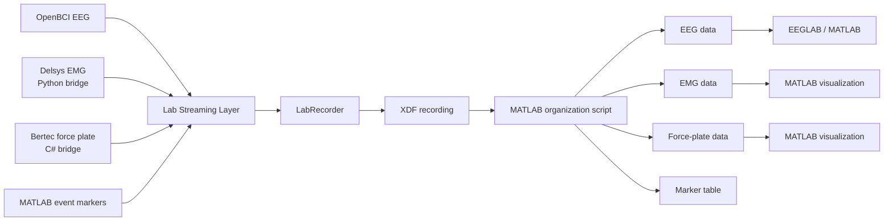

# Multimodal Balance Research Pipeline

This repository contains the acquisition and data-processing scripts developed for a 2026 summer research project at High Point University.

The system was designed to collect and synchronize:

- OpenBCI EEG data
- Delsys Trigno EMG data
- Bertec force-plate data
- Experimental event markers

Lab Streaming Layer (LSL) is used to send the data streams to LabRecorder, where they are recorded together in XDF format. MATLAB scripts are then used to organize, inspect, and visualize the recorded data.

## System Workflow

## Repository Structure

### `lsl_streaming`

Contains the scripts used during data collection.

- MATLAB event-marker interfaces
- Python Delsys EMG-to-LSL bridge
- C# Bertec force-plate-to-LSL bridge
- Earlier experimental Bertec connection scripts

### `data_processing_matlab`

Contains the scripts used after recording.

- XDF stream organization
- EEG, EMG, and force-plate plotting
- Event-marker visualization
- Frequency and interference analysis
- EEG preparation for EEGLAB

## Hardware

The original research setup used:

- OpenBCI Ultracortex Mark IV
- OpenBCI Cyton board
- Delsys Trigno EMG sensors and Trigno Centro
- Bertec force plate

## Software

The project was developed using:

| Software | Version or environment |
|---|---|
| Windows | Windows 11 |
| MATLAB | R2026a |
| EEGLAB | 2026.0.0 |
| OpenBCI GUI | 6.0.0-beta.1 |
| Lab Streaming Layer | MATLAB, Python, and C# libraries |
| Python | Used for the Delsys bridge |
| Visual Studio / C# | Used for the Bertec bridge |

The Delsys API, Bertec SDK, manufacturer libraries, and license credentials are not included in this repository.

## General Recording Procedure

1. Start the OpenBCI EEG stream.
2. Start the Delsys Python bridge.
3. Start the Bertec C# bridge.
4. Open the MATLAB event-marker interface.
5. Confirm that all required streams appear in LabRecorder.
6. Record the session as an XDF file.
7. Run the MATLAB organization script.
8. Inspect the EEG, EMG, force-plate, and marker data.

More detailed setup instructions will be added within the individual folders and scripts.

## Important Notes

- Local software paths must be updated for each computer.
- Stream names, channel counts, and sampling rates should be checked before every recording.
- Calculated force-plate variables are not all direct measurements.
- Manufacturer APIs and SDKs may change between software versions.

## Project Status

The repository structure and documentation are currently being improved. The scripts were tested in their original locations and will be revalidated after the recent file and folder reorganization.

## Author

**Jackson Cirami**  
Mechanical Engineering  
High Point University

Developed during the 2026 Summer Undergraduate Research Experience under the mentorship of Dr. Neil Petroff.
