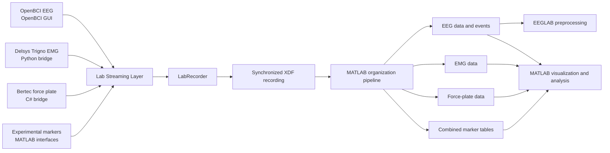

# Multimodal Data Acquisition Pipeline

A cross-language workflow for acquiring, synchronizing, organizing, and inspecting multimodal physiological and biomechanical data from EEG, EMG, force-plate, and experimental event-marker streams.

The system integrates manufacturer-specific acquisition tools with [Lab Streaming Layer (LSL)](https://labstreaminglayer.org/) so that all streams can be recorded together in LabRecorder as a single XDF session. MATLAB scripts then organize the recording, preserve stream timing and metadata, prepare EEG data for EEGLAB, and support multimodal visualization and signal-quality analysis.

This repository was developed during the 2026 Summer Undergraduate Research Experience at High Point University.

## System Overview



## Repository Contents

```text
Multimodal-Data-Acquisition/
├── lsl_streaming/
│   ├── python/          Delsys Trigno EMG-to-LSL bridge
│   ├── matlab/          Task and MVC event-marker interfaces
│   ├── csharp/          Bertec force-plate-to-LSL bridge and test utility
│   └── experimental/    Earlier prototypes and alternate approaches
├── data_processing/
│   ├── eeglab/          EEG import and EEGLAB helper scripts
│   ├── visualization/   EEG, EMG, force-plate, and frequency-analysis scripts
│   └── organize_multimodal_xdf.m
├── README.md
└── LICENSE
```

| Component | Purpose | Documentation |
|---|---|---|
| Delsys Python bridge | Detects enabled Delsys Trigno EMG channels and broadcasts them through LSL | [`lsl_streaming/python/`](lsl_streaming/python/) |
| Bertec C# bridge | Acquires Bertec force and moment channels, derives COP/COG estimates, and broadcasts an 18-channel LSL stream | [`lsl_streaming/csharp/`](lsl_streaming/csharp/) |
| MATLAB marker interfaces | Broadcasts task, artifact, impedance, MVC, rest, and muscle-identification markers | [`lsl_streaming/matlab/`](lsl_streaming/matlab/) |
| Experimental scripts | Preserves prototype Bertec communication approaches for reference and troubleshooting | [`lsl_streaming/experimental/`](lsl_streaming/experimental/) |
| Data-processing pipeline | Organizes XDF recordings, imports EEG into EEGLAB, plots each modality, and evaluates frequency content and interference | [`data_processing/`](data_processing/) |

## Core Capabilities

- Synchronizes EEG, EMG, force-plate, and event-marker streams through LSL.
- Records all selected streams together in LabRecorder/XDF.
- Supports separate task and MVC marker streams with fixed names and source IDs.
- Organizes raw XDF streams into documented MATLAB variables and a combined multimodal structure.
- Preserves original timestamps, sampling-rate metadata, channel labels, and marker-source information.
- Exports combined and stream-specific marker tables.
- Imports organized EEG data and XDF events into EEGLAB using timing derived from the original recording.
- Provides configurable EEG, EMG, and force-plate plotting scripts with event overlays.
- Includes frequency-content and 60 Hz interference analysis utilities.
- Retains experimental integration scripts to document the development process and support future troubleshooting.

## Hardware Used During Development

The original research configuration used:

- OpenBCI Ultracortex Mark IV headset
- OpenBCI Cyton board
- Delsys Trigno sensors with a Trigno Centro receiver
- Bertec force plate

The code may be adaptable to other hardware configurations, but stream metadata, channel names, sampling rates, SDK behavior, and downstream assumptions must be verified before use.

## Software and External Dependencies

The workflow spans several software environments:

| Environment | Primary role |
|---|---|
| OpenBCI GUI | EEG acquisition and LSL streaming |
| Python | Delsys Trigno EMG bridge |
| C# / Visual Studio | Bertec force-plate bridge |
| MATLAB | Event-marker interfaces, XDF organization, visualization, and analysis |
| EEGLAB | EEG preprocessing and event-based analysis |
| LabRecorder | Synchronized XDF recording |

Important external dependencies include:

- Lab Streaming Layer libraries for MATLAB, Python, and C#
- LabRecorder
- xdf-Matlab
- EEGLAB
- Delsys API, Aero/AeroPy resources, and valid credentials
- Bertec SDK and `BertecDeviceNET`

Proprietary manufacturer libraries, SDK components, credentials, licenses, and hardware-specific project files are not distributed in this repository. See the README in each component folder for setup requirements and tested versions.

## Getting Started

This repository is a modular research workflow rather than a single executable application. Configure and validate each acquisition component independently before attempting a synchronized recording.

### 1. Configure the acquisition streams

Follow the component-specific instructions:

- [`lsl_streaming/python/README.md`](lsl_streaming/python/README.md) — Delsys EMG bridge
- [`lsl_streaming/matlab/README.md`](lsl_streaming/matlab/README.md) — Event-marker interfaces
- [`lsl_streaming/csharp/README.md`](lsl_streaming/csharp/README.md) — Bertec force-plate bridge

The OpenBCI EEG stream is configured through the OpenBCI GUI and is not generated by a custom script in this repository.

### 2. Validate the streams in LabRecorder

Before recording, confirm that the required streams are visible and that their names, source IDs, channel counts, channel order, sampling rates, and data types match the intended configuration.

The custom streams use the following default names:

| Stream | Default name |
|---|---|
| Delsys EMG | `Delsys_Trigno_EMG` |
| Bertec force plate | `BertecForcePlate` |
| Task markers | `TaskMarkers` |
| MVC markers | `MVCMarkers` |

The OpenBCI stream name depends on the OpenBCI GUI configuration.

### 3. Record a synchronized session

Start each required acquisition component, verify live data and marker events, and record the selected streams together in LabRecorder as an XDF file.

### 4. Organize the XDF recording

Run:

```matlab
organize_multimodal_xdf
```

The script displays the streams in the selected XDF file, prompts for the EEG, EMG, force-plate, and marker stream numbers, and saves organized MATLAB and CSV outputs.

### 5. Process and inspect the data

Use the scripts in [`data_processing/`](data_processing/) to:

- import EEG data and events into EEGLAB;
- visualize EEG, EMG, and force-plate channels;
- overlay event markers;
- inspect frequency content; and
- evaluate possible 60 Hz electrical interference.

## Important Use Notes

- Update all local library, SDK, and resource paths before running the scripts.
- Do not assume that manufacturer APIs, channel names, or example-application structures are identical across software versions.
- Keep the Bertec force plate unloaded during the software-tare period.
- Confirm the fixed Bertec output-channel order before using downstream analyses.
- The Bertec COG outputs are estimates derived from force-plate data, not direct measurements.
- Verify that enabled Delsys channels share the expected sampling configuration before recording.
- Inspect the complete XDF stream list before selecting stream indices during organization.

## Project Scope

This repository documents the acquisition and processing infrastructure developed for multimodal balance research. It is intended to support adaptation, troubleshooting, and future development across changing vendor software and hardware environments.

The scripts are research tools and should be independently validated for each laboratory configuration before they are used for formal data collection or analysis.

## Author

**Jackson Cirami**  
Mechanical Engineering  
High Point University

Developed during the 2026 Summer Undergraduate Research Experience at High Point University under the mentorship of Dr. Neil Petroff.

## Copyright

Copyright (c) 2026 Jackson Cirami. All rights reserved.

## License

This project is licensed under the PolyForm Noncommercial License 1.0.0. See the [LICENSE](LICENSE) file for the complete license text.

The software may be used for academic, educational, research, and other non-commercial purposes in accordance with that license.

Commercial use—including incorporation into commercial software, products, consulting services, or other revenue-generating activities—requires a separate commercial license from the copyright holder.

For commercial licensing inquiries, please contact:

Jackson Cirami  
jackson.cirami@gmail.com
